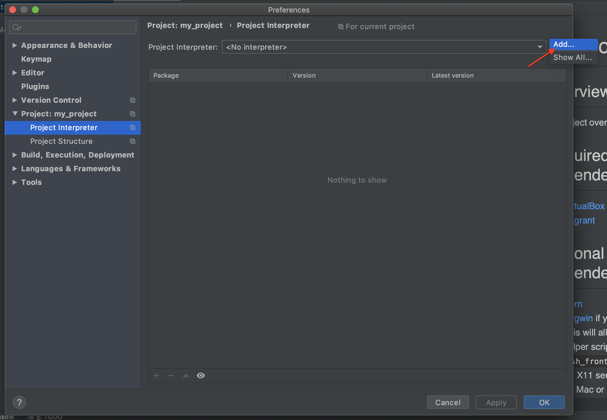
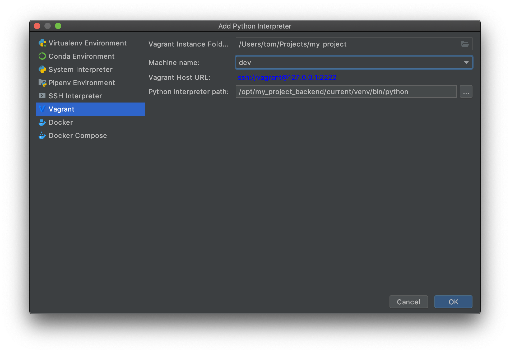
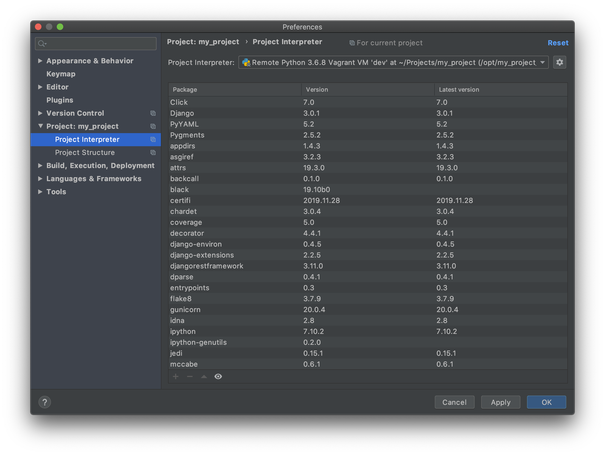

# Configuring PyCharm

## Setting up a Remote Python Interpreter

To ensure that many PyCharm features work correctly, we need to configure PyCharm to use
the Python interpreter from our Vagrant VM.

Go to `File → Settings → Project → Project Interpreter`. Click the gear icon and click 'Add'.

Select 'Vagrant' from the side panel. Change the 'Vagrant Instance Folder' to your
project's directory, select the 'dev' VM, and set the 'Python Interpreter Path' to
`/opt/{{ cookiecutter.project_slug }}_backend/current/venv/bin/python`.

Click 'OK'. You should now see that the packages from the backend app's virtualenv are
listed.

Click 'OK'. 