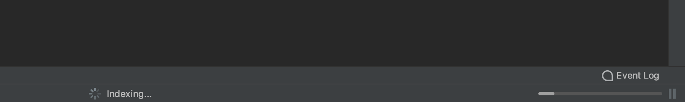
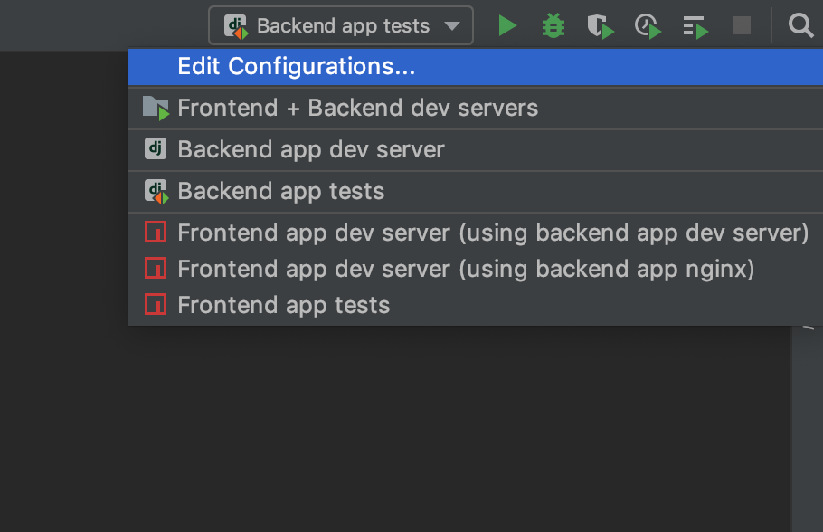
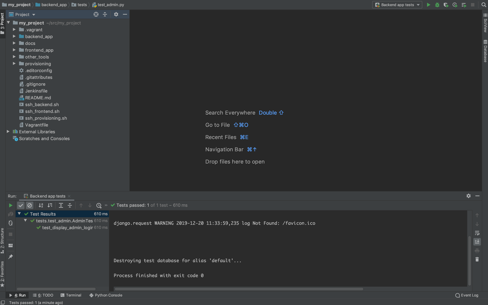
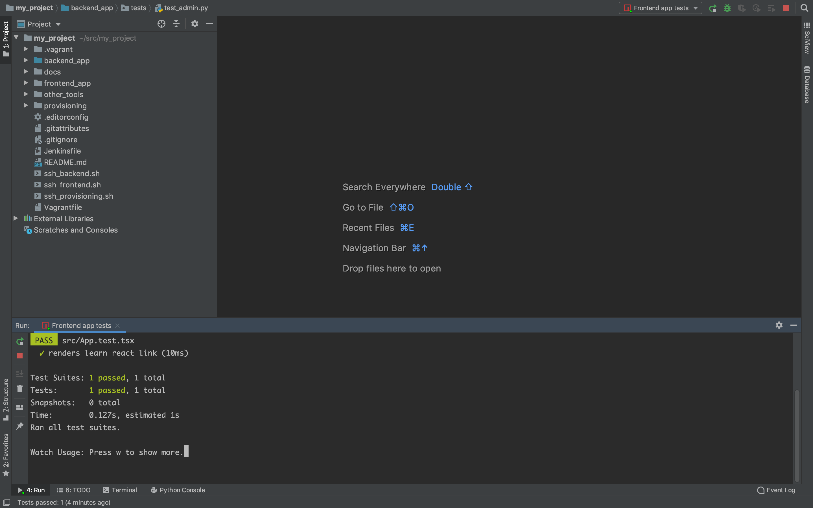

# Configuring PyCharm

## Setting up a Remote Python Interpreter

> Support for Vagrant Python interpreters is a feature of PyCharm Professional.
> If you don't see an option to add a Vagrant interpreter you may be using
> PyCharm Community Edition.

To ensure that many PyCharm features work correctly, we need to configure PyCharm to use
the Python interpreter from our Vagrant VM.

Go to `File → Settings → Project → Project Interpreter`. Click the gear icon and click 'Add'.

Select 'Vagrant' from the side panel. Change the 'Vagrant Instance Folder' to your
project's directory, select the 'dev' VM, and set the 'Python Interpreter Path' to
`/opt/{{ cookiecutter.project_slug }}_backend/venv/bin/python`.

Click 'OK'. You should now see that the packages from the backend app's virtualenv are
listed.

Click 'OK' again. PyCharm will spend the next couple of minutes indexing:

Once it's finished indexing you should be ready to go.

## Running backend app tests from PyCharm

This project comes with several preconfigured PyCharm run configurations

> **INFO**: If you seeing a red cross next to the django run configurations,
> click 'Edit Configurations' and set the 'Python Interpreter' for each
> django configuration as the Remote Python from Vagrant VM 'dev'.

To run the unit tests for the django backend app, select 'Backend app tests' and
click the green play button:

## Running frontend app tests from PyCharm

> **INFO**: You need to have `node` and `yarn` installed on your host machine to
> run these commands from PyCharm.

To run the unit tests for the react frontend app, select 'Frontend app tests' and
click the green play button:

